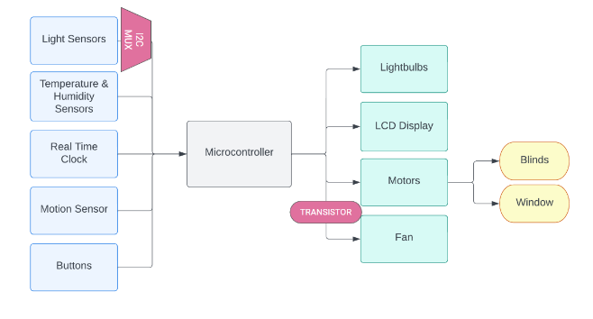
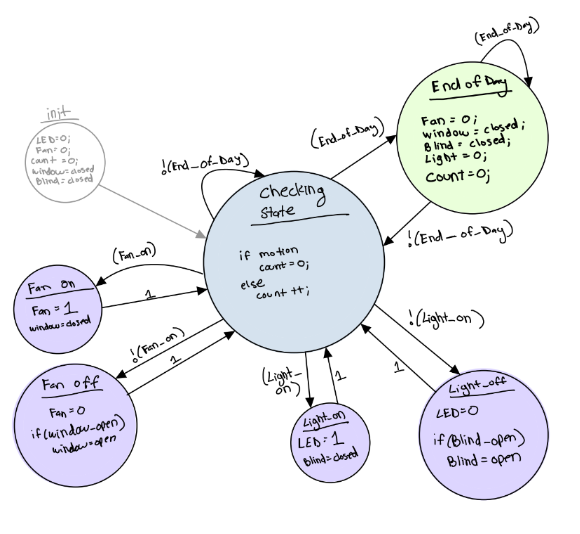
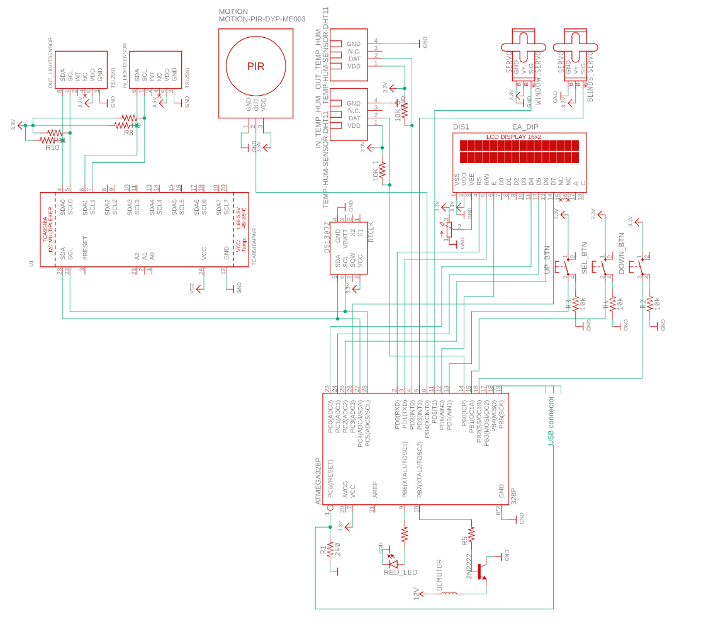
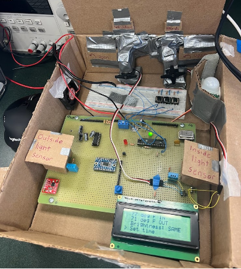

# Bright Breeze
## Embedded Systems Design Laboratory Capstone
EE 459 Spring 2023
Anjali Gopinathan, Riyana Gobin, Kimberle Sotelo

A SMART Home Ventilation and Lighting Optimizer

## Introduction
Heating, ventilation, and air conditioning (HVAC) consume approximately 40% of a building's electricity. Many air conditioning units stay on all day despite having ideal temperature conditions outdoors and sometimes are often left on even when someone leaves the house. Heating and cooling efficiency is the most effective way that people can decrease their overall energy consumption. This proposed Smart HVAC System uses smart devices and sensors in your household that allows your system to automatically adjust itself, based on a number of sensory inputs, custom settings and schedules. Being an environmentally conscious consumer-centric system, it can not only improve a building’s energy efficiency, but can also provide an occupant with optimal comfort and convenience by automatically optimizing the temperature conditions whilst requiring limited human interaction. It saves energy by adjusting to the ideal settings based on factors such as sunset time, sunrise time, user’s bedtime and wake up time. The system controls the lights, window and air conditioning system within a home according to the outdoor temperatures and preset inputs. The HVAC system would not be required to expend as much energy if the outdoor temperatures are close to the ideal temperature. In turn, use of the system will cut energy consumption and costs. In a residential context, residents would not have to worry about adjusting the temperatures or opening the windows whilst at home. By automatically adjusting indoor lighting, temperature and ventilation according to current occupancy, weather conditions and more in real-time, this SMART system can reduce wasteful energy consumption to consume no more energy resources than needed. 

## Overview

This product is a device that optimizes the lighting, temperature, and ventilation in a home to reduce energy consumption. It takes into account the brightness inside and outside the house, the temperatures inside and outside the home, and the time of day. This information combined can help the product make SMART decisions to optimize the lights, windows, and AC systems in a home. This product aims to automatically adjust the lighting inside a home, whether or not the windows and blinds should be opened, and whether the AC system should be turned on. Users can set their bedtime and wake-up time for the system to execute various actions. In Section IV, we have outlined the SMART decisions that the product makes.

## Block Diagram
  

## State Machine
  

There are various SMART decisions that the product makes in order to achieve the goals of both home automation and saving energy consumption. 
### Light Conditions
When it is dark inside the home but bright outside the home, then the device should turn off the lights and open the blind. Conversely, if the inside is either brighter or the same as outside, then we want to turn the lights on and close the blinds. 
### Fan Conditions
If the indoor temperature is both greater than the user-set target temperature and less than 80 degrees Fahrenheit, then we want to reach our target temperature by turning the fan off and closing the windows. If both the inside and outside temperatures are over 80 degrees Fahrenheit, then the fan should stay on and the windows closed. Finally, if the outside temperature is cooler than the inside temperature and below the target temperature, then the window should open and the fan should turn off. 
### Motion Conditions
If there hasn’t been any motion indoors for over 30 minutes, then the device assumes that no one is inside and turns the lights and fan off and closes the windows and blinds.
### Sunset Conditions
If the current time is after sunset, the device assumes it is now dark outside and turns the lights on inside while closing the blinds. The lights will remain on as long as there hasn’t been a motion time out or it is the end of the day.
### End of Day Condition
If the current time is after the user’s set bedtime and before their wakeup time, then the device turns off the lights and fan and closes the windows and blinds. This is essentially shutting off the device until the current time reaches the wakeup time set by the user. Once it is wakeup time, then the device will power back on and continue to function as described above.

The state transition conditions are outlined in more detail below:

```c
Fan_On = (inside_temp >= 80) && (outside_temp >= 80) && (time_without_motion <= 30)
End_Of_Day = (wakeup_time > current_time) && (bedtime < current_time)
Window_Open = (outside_temp < inside_temp) && (time_without_motion <= 30) && (outside_temp >= 65)
Light_On = ((outside_brightness < inside_brightness) || (current_time > sunset_time)) && (time_without_motion <= 30)
Blind_Open = (outside_brightness >= inside_brightness) && (time_without_motion <= 30)
```

## Components
Schematic of system
  
### Inputs

#### Light Sensors 
Two light sensors are used - one light sensor is placed inside the home, and one is placed outside the home. The light sensor inside the home is ideally mounted on a wall that faces a window. The values from these sensors contribute to controlling the lights and blinds. The light sensors, TCA2591, are programmed using the I2C protocol. When using multiple light sensors it is important to note that an I2C multiplexer is necessary since the light sensors use the same address. Without the multiplexer, the Atmega328P chip would not be able to correctly communicate with the sensors over I2C. The 8-channel multiplexer, TCA9548, is wired directly to the SCA and SDL ports on the microcontroller. Two of the 8 channels on the multiplexer are used by the light sensors, and the remaining 6 channels go unused. The I2C pins on each light sensor are wired to the corresponding channel’s SDL and SCA ports on the multiplexer. Using polling, the Atmega328p collects both light sensors’ values to obtain a compared result, representing whether the outside light sensor or the inside light sensor is detecting more light at the current time. With this compared result, the main state machine can then make the respective SMART decisions.
#### Temperature Sensors
Two temperature sensors are used: one sensor is placed inside the home, and one is placed outside the house. Each temperature sensor, DHT11, is connected to a digital pin on the microcontroller and returns an 8 bit value for the whole part and another 8 bit value for the fractional part of the temperature. This is measured in Celcius by default and is then converted to Fahrenheit. The temperature sensor collects data using polling.
#### Real Time Clock
A real time clock, DS1307, is used to monitor the current time of day. The real time clock uses I2C protocol to communicate with the microcontroller. Since only one real time clock is needed and it has a unique address, this component can be wired directly to the SDL and SCA ports on the Atmega328P instead of through the multiplexer. Once the initial time is set by either the user or programmer, then the real time clock internally updates the time. In order for the Atmega328p to hold the correct time, the programmer must read in the time values from the component before using them. This is done using polling. An outcome of the real time clock keeping the current time of day is that the amount of time that has passed since motion was last detected is easily calculated. This is a helpful value for determining if there are occupants moving around the house.
#### Motion Sensor
A motion sensor is placed inside the house. It is used to monitor human activity inside so that if there isn’t anyone currently there, then we can save energy by turning off the lights. The motion sensors check for motion in the Checking State. If no motion has been detected for 30 minutes, then the fan and lights are turned off. 
#### Buttons
Multiple buttons are used to allow users to navigate through the user interface. They can scroll through the BrightBreeze Menu to view current conditions inside and outside of the house as well as set and change the temperature thresholds. Additionally, they can navigate the menu to set the current time, bedtime and wake up time that allow the system to control the outputs accordingly. Debouncing is utilized to allow for users to easily interact with the menu. 
### Outputs
#### LED
An LED is used to simulate the lighting inside the home. This LED is controlled by the state machine, not the user. The LED is connected to pin PB4 on the Atmega328p which is also connected to the USB connector due to a shortage of pin availability. Once the device is initially flashed, the USB connector is removed to allow the LED to operate without interference. 
#### LCD Display
The display is used to show the user which lights are currently on or off in the house. It should also display current temperature inside and outside the house. Finally, the display is the main user interface allowing for manual modification of threshold settings. 
#### Blinds and window operation
Two standard positional rotation servo motors are incorporated into the project to simulate 
  * Pulling blinds via a chain up and down and
  * Physically opening a window
Each of these motors are controlled by the state machine, not by the user directly, enabling more automation. The servo motors are programmed using pulse width modulation (PWM) on the 8-bit timers, Timer0 and Timer2 on the Atmega328p, respectively. 
#### Fan 
A fan is used to mimic the AC system in a home. This fan is a basic 12V DC motor. This is the only component that takes higher than 5V of input. Thus, a 12V DC power supply is connected to the fan. In order for the Atmega328p to control the fan, a transistor is used to amplify the signal coming from a digital pin of the Atmega328p. The transistor acts as a switch that is turned on and off by the Atmega328p, allowing it to control the flow of current to the fan. This is necessary because the Atmega328p can only provide a small amount of current to the fan, while the fan requires a larger amount to operate. By using a transistor to amplify the signal, the Atmega328p can effectively control the fan without risking damage to either component.

  
